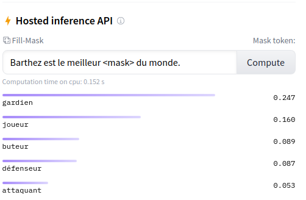

# BARThez
A french sequence to sequence pretrained model. [https://arxiv.org/abs/2010.12321]

## Introduction
A french sequence to sequence pretrained model based on [BART](https://github.com/pytorch/fairseq/tree/master/examples/bart). <br>
BARThez is pretrained by learning to reconstruct a corrupted input sentence. A corpus of 66GB of french raw text is used to carry out the pretraining. <br>
Unlike already existing BERT-based French language models such as CamemBERT and FlauBERT, BARThez is particularly well-suited for generative tasks, since not only its encoder but also its decoder is pretrained. 

In addition to BARThez that is pretrained from scratch, we continue the pretraining of a multilingual BART [mBART](https://github.com/pytorch/fairseq/tree/master/examples/mbart) which boosted its performance in both discriminative and generative tasks. We call the french adapted version mBARThez.

| Model         | Architecture  | #layers | #params | Link  |
| ------------- |:-------------:| :-----:|:-----:|:-----:|
| BARThez       | BASE          | 12     | 216M  | [Link](https://www.dropbox.com/s/a1y5avgb8uh2v3s/barthez.base.zip?dl=1) |
| mBARThez      | LARGE         | 24     | 561M  |[Link](https://www.dropbox.com/s/oo9tokh09rioq0m/mbarthez.large.zip?dl=1) |

## On Hugging Face

Our models are now on Hugging face!

| BARThez             |  BARThez fine-tuned on abstract generation | BARThez fine-tuned on title generation |
:-------------------------:|:-------------------------:|:------------------------------:|
[](https://huggingface.co/moussaKam/barthez)  |  [](https://huggingface.co/moussaKam/barthez-orangesum-abstract) | [](https://huggingface.co/moussaKam/barthez-orangesum-title)

### Summarization

First make sure that you have sentencepiece installed:
```
pip install sentencepiece
```

To fine-tune the model on a summarization dataset you can follow the `seq2seq` [example](https://github.com/huggingface/transformers/tree/master/examples/seq2seq) in the `Transformers` library.

For example:
```
python examples/seq2seq/run_seq2seq.py \
    --model_name_or_path moussaKam/barthez \
    --do_train     --do_eval \
    --task summarization \
    --train_file ../OrangeSumTransformers/abstract_generation/train.csv \
    --validation_file ../OrangeSumTransformers/abstract_generation/val.csv \
    --output_dir orangesum_abstract_output \
    --per_device_train_batch_size=4 \
    --per_device_eval_batch_size=4 \
    --overwrite_output_dir \
    --predict_with_generate \
    --fp16 \
    --text_column documents \
    --summary_column summaries \
    --num_train_epochs 10 \
    --save_steps 10000
``` 
Make sure that your dataset files are in the required format.

For inference you can use the following code:
```python
text_sentence = "Citant les préoccupations de ses clients dénonçant des cas de censure après la suppression du compte de Trump, un fournisseur d'accès Internet de l'État de l'Idaho a décidé de bloquer Facebook et Twitter. La mesure ne concernera cependant que les clients mécontents de la politique de ces réseaux sociaux."

import torch

from transformers import (
    AutoTokenizer,
    AutoModelForSeq2SeqLM
)

barthez_tokenizer = AutoTokenizer.from_pretrained("moussaKam/barthez")
barthez_model = AutoModelForSeq2SeqLM.from_pretrained("moussaKam/barthez-orangesum-abstract")

input_ids = torch.tensor(
    [barthez_tokenizer.encode(text_sentence, add_special_tokens=True)]
)

barthez_model.eval()
predict = barthez_model.generate(input_ids, max_length=100)[0]


barthez_tokenizer.decode(predict, skip_special_tokens=True)
```
### Text Classification

It is possible to use BARThez for text classification tasks, such as sentiment analysis.

To fine-tune the model you can directly use the `text-classification` [example](https://github.com/huggingface/transformers/tree/master/examples/text-classification) in the `Transformers` library.
```
python run_glue.py \
   --model_name_or_path moussaKam/barthez \
   --tokenizer_name moussaKam/barthez \
   --train_file  PATH_TO_TRAIN_SET \
   --validation_file PATH_TO_VALID_SET \
   --do_train  --do_eval \
   --max_seq_length 1024 \
   --per_device_train_batch_size 4 \
   --learning_rate 2e-5 \
   --num_train_epochs 10 \
   --output_dir cls_checkpoints \
   --overwrite_output_dir \
   --fp16
```

For inference:
```python
text_sentence = "Barthez est le meilleur gardien du monde"
import torch

from transformers import (
    AutoTokenizer,
    AutoModelForSequenceClassification
)

barthez_tokenizer = AutoTokenizer.from_pretrained("moussaKam/barthez")
barthez_model = AutoModelForSequenceClassification.from_pretrained("moussaKam/barthez-sentiment-classification")

input_ids = torch.tensor(
    [barthez_tokenizer.encode(text_sentence, add_special_tokens=True)]
)

predict = barthez_model.forward(input_ids)[0]

print("positive" if predict.argmax(dim=-1).item()==1 else "negative") 
```


## On Fairseq

### Summarization
Thanks to its encoder-decoder structure, BARThez can perform generative tasks such as summarization. In the following, we provide an example on how to fine-tune BARThez on title generation task from OrangesSum dataset:  

#### Get the dataset
Please follow the steps [here](https://github.com/moussaKam/OrangeSum) to get OrangeSum. 

#### Install fairseq
```
git clone https://github.com/moussaKam/BARThez
cd BARThez/fairseq
pip install --editable ./
```

#### Sentencepiece Tokenization
Install sentencepiece from [here](https://github.com/google/sentencepiece) <br> 
Encode the data using `spm_encode`. In total there will be 6 files to tokenize. <br>
You can refer to `summarization_data_title_barthez/encode_spm.sh` script. 

#### Data binarization. 
To be able to use the data for training, it should be first preprocessed using `fairseq-preprocess`. <br>
Refer to `summarization_data_title_barthez/binarize.sh` script.

#### Train the model.
It's time to train the model.  <br> 
Use the script in `experiments/title_generation/barthez_summarization_title.sh` <br> 
```
cd experiments/title_generation/
bash barthez_summarization_title.sh 1
```
1 refers to the seed <br>
The Training takes roughly 3 hours on 1GPU TITAN RTX.

#### Generate summaries.
To generate the summaries use `generate_summary.py` script:
```
python generate_summary.py \
    --model_path experiments/checkpoints/translation/summarization_title_fr/barthez/ms4096_mu60000_lr1e-04_me50_dws1/1/checkpoint_best.pt \
    --output_path experiments/checkpoints/translation/summarization_title_fr/barthez/ms4096_mu60000_lr1e-04_me50_dws1/1/output.txt \ 
    --source_text summarization_data_title_barthez/test-article.txt \
    --data_path summarization_data_title_barthez/data-bin/ \
    --sentence_piece_model barthez.base/sentence.bpe.model
```
we use [rouge-score](https://pypi.org/project/rouge-score/) to compute ROUGE score. No stemming is applied before evaluation.

### Text Classification
In addition to text generation, BARThez can perform discriminative tasks. For example to fine-tune the model on PAWSX task:

#### Dataset 
To get the dataset use `FLUE/prepare_pawsx.py`:
```
mkdir discriminative_tasks_data/
cd discriminative_tasks_data/
python ../FLUE/prepare_pawsx.py
```

#### Sentencepiece Tokenization
```
cd PAWSX

SPLITS="train test valid"
SENTS="sent1 sent2"

for SENT in $SENTS
do
    for SPLIT in $SPLITS
    do
        spm_encode --model ../../barthez.base/sentence.bpe.model < $SPLIT.$SENT > $SPLIT.spm.$SENT
    done
done
```

#### Data binarization.
```
DICT=../../barthez.base/dict.txt

fairseq-preprocess \
  --only-source \
  --trainpref train.spm.sent1 \
  --validpref valid.spm.sent1 \
  --testpref test.spm.sent1 \
  --srcdict ${DICT} \
  --destdir data-bin/input0 \
  --workers 8

fairseq-preprocess \
  --only-source \
  --trainpref train.spm.sent2 \
  --validpref valid.spm.sent2 \
  --testpref test.spm.sent2 \
  --srcdict ${DICT} \
  --destdir data-bin/input1 \
  --workers 8 

fairseq-preprocess \
  --only-source \
  --trainpref train.label \
  --validpref valid.label \
  --testpref test.label \
  --destdir data-bin/label \
  --workers 8
```
#### Train the model.

Use the script `experiments/PAWSX/experiment_barthez.sh` <br> 
```
cd experiments/PAWSX/
bash experiment_barthez.sh 1
```
1 refers to the seed <br>

#### Get valid and test accuracy:
Use the script `compute_mean_std.py`:
```
python compute_mean_std.py --path_events experiments/tensorboard_logs/sentence_prediction/PAWSX/barthez/ms32_mu23200_lr1e-04_me10_dws1/
```
In case you ran the training for multiple seeds, this script helps getting the mean, the median and the standard deviation of the scores. The valid score corresponds to the best valid score across the epochs, and the test score corresponds to the test score of the epoch with the best valid score.

#### Inference
For inference you can use the following code:
```python
from fairseq.models.bart import BARTModel

barthez = BARTModel.from_pretrained(
    '.',
    checkpoint_file='experiments/checkpoints/sentence_prediction/PAWSX/barthez/ms32_mu23200_lr1e-04_me10_dws1/1/checkpoint_best.pt',
    data_name_or_path='discriminative_tasks_data/PAWSX/data-bin/',
    bpe='sentencepiece',
    sentencepiece_vocab='barthez.base/sentence.bpe.model',
    task='sentence_prediction'
)

label_fn = lambda label: barthez.task.label_dictionary.string(
    [label + barthez.task.label_dictionary.nspecial]
)
barthez.cuda()
barthez.eval()

sent1 = "En 1953, l'équipe a également effectué une tournée en Australie ainsi qu'en Asie en août 1959."
sent2 = "L’équipe effectua également une tournée en Australie en 1953 et en Asie en août 1959."

tokens = barthez.encode(sent1, sent2, add_if_not_exist=False)
prediction = barthez.predict('sentence_classification_head', tokens).argmax().item()
prediction_label = int(label_fn(prediction))
print(prediction_label)
```

If you use the code or any of the models, you can cite the following paper:
```
@article{eddine2020barthez,
  title={BARThez: a Skilled Pretrained French Sequence-to-Sequence Model},
  author={Eddine, Moussa Kamal and Tixier, Antoine J-P and Vazirgiannis, Michalis},
  journal={arXiv preprint arXiv:2010.12321},
  year={2020}
}
```
